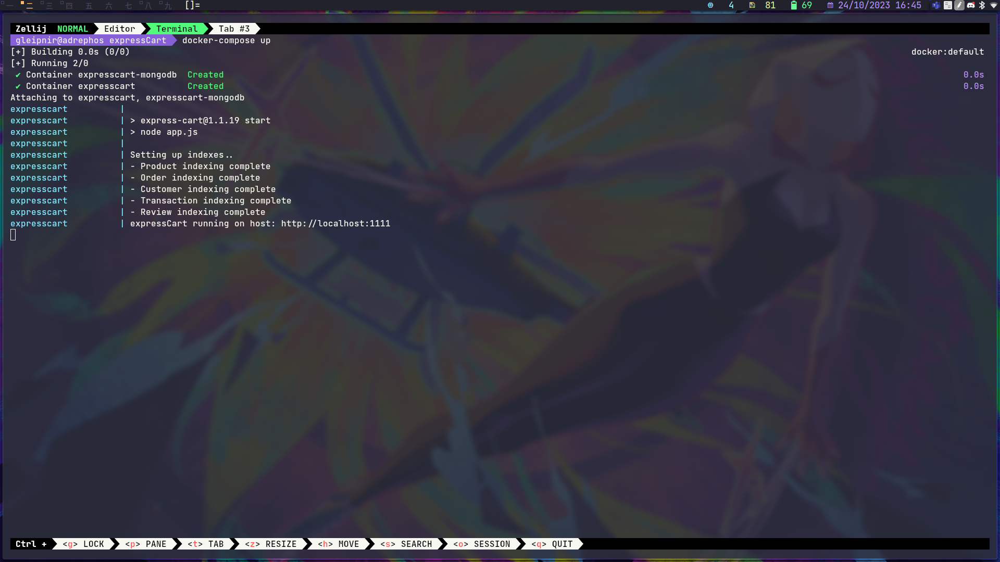

Check out the documentation [here](https://github.com/mrvautin/expressCart/wiki).

View the demo shop [here](https://expresscart-demo.markmoffat.com/).

---

To build and run the containers, do:

```
$ docker-compose up --build
```
If you only want to run both containers, do:
```
$ docker-compose up
```
The running containers look like this:

